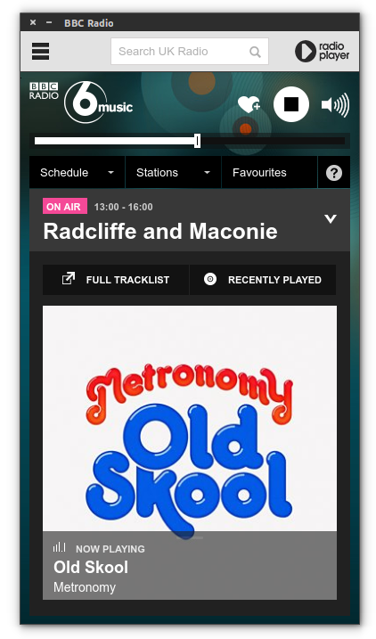

<div style="text-align:center"></div>

> Unofficial BBC Radio Desktop App


<div align="center"></div>


### Linux

[**Download**](https://github.com/tiagomachado/electron-bbc-radio/releases/latest) and unzip to some location.

To add a shortcut to the app, create a file in `~/.local/share/applications` called `BBC-Radio.desktop` with the following contents:

```
[Desktop Entry]
Type=Application
Name=BBC-Radio
Icon=/full/path/to/folder/electron-bbc-radio/dist/BBC-Radio-linux-x64/resources/app/img/icon.png
Exec=/full/path/to/folder/electron-bbc-radio/dist/BBC-Radio-linux-x64/BBC-Radio
Terminal=false
```


## License

MIT ©
